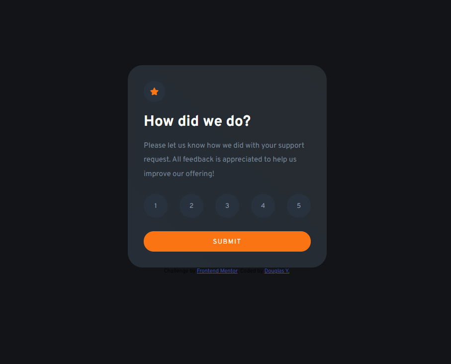

# Frontend Mentor - Interactive rating component solution

This is a solution to the [Interactive rating component challenge on Frontend Mentor](https://www.frontendmentor.io/challenges/interactive-rating-component-koxpeBUmI). Frontend Mentor challenges help you improve your coding skills by building realistic projects. 

## Table of contents

- [Overview](#overview)
  - [The challenge](#the-challenge)
  - [Screenshot](#screenshot)
  - [Links](#links)
- [My process](#my-process)
  - [Built with](#built-with)
  - [What I learned](#what-i-learned)

## Overview

### The challenge

Users should be able to:

- View the optimal layout for the app depending on their device's screen size
- See hover states for all interactive elements on the page
- Select and submit a number rating
- See the "Thank you" card state after submitting a rating

### Screenshot




### Links

- Live Site URL: [https://douglas-yokomizo.github.io/interactive-rating-component-main/]

## My process

- I start creating a the structure of the website with html elements
- After creating the website I create the stylesheet
- Then I break down the logic behind the actions I need to perform
- So I can start coding with JS

### Built with

- Semantic HTML5 markup
- CSS custom properties
- Flexbox
- JavaScript

### What I learned

- I've got new insights on CSS, like how to make animations and gradients
- How to build the javascript component and the logic behind it

```js
rates.forEach((rate) => {
    rate.addEventListener('click', () =>{
        rating.innerHTML = rate.innerHTML;
    })
})
```

## Author

- Website - [Douglas Y.](https://www.linkedin.com/in/yogiyk)
- Frontend Mentor - [@douglas-yokomizo](https://www.frontendmentor.io/profile/douglas-yokomizo)
